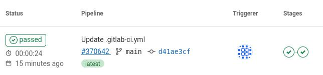

# gitlab_pipeline_examples

## trigger downstream project builds

https://docs.gitlab.com/ee/ci/yaml/#trigger

### Job1
```
variables:
  DOCKER_TAG: 1.0.1-release

stages:
  - test
  - deploy

test:
  stage: test
  script:
    - |
      echo $DOCKER_TAG

deploy:
  stage: deploy
  trigger: awiechert/job2
```

### Job 2
```
deploy:
  stage: deploy
  script:
    - echo $DOCKER_TAG
```

### Result




## trigger with manual click


### Job1
```
variables:
  DOCKER_TAG: 1.0.1-release

stages:
  - test
  - deploy

test:
  stage: test
  script:
    - |
      echo $DOCKER_TAG

deploy:
  stage: deploy
  trigger: awiechert/job2
  when: manual
```


