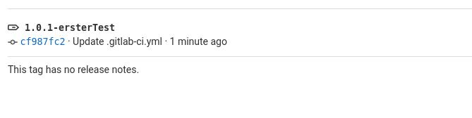
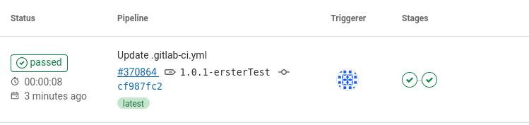
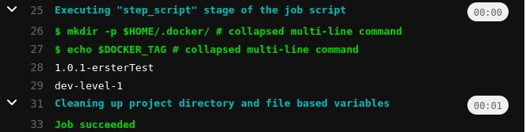

# gitlab_pipeline_examples

## trigger downstream project builds

https://docs.gitlab.com/ee/ci/yaml/#trigger

### Job1
```
variables:
  DOCKER_TAG: 1.0.1-release

stages:
  - test
  - deploy

test:
  stage: test
  script:
    - |
      echo $DOCKER_TAG

deploy:
  stage: deploy
  trigger: awiechert/job2
```

### Job 2
```
deploy:
  stage: deploy
  script:
    - echo $DOCKER_TAG
```

### Result


## trigger with manual click

### Job1
```
variables:
  DOCKER_TAG: 1.0.1-release

stages:
  - test
  - deploy

test:
  stage: test
  script:
    - |
      echo $DOCKER_TAG

deploy:
  stage: deploy
  trigger: awiechert/job2
  when: manual
```


## prefilled variables

https://gitlab.com/gitlab-org/gitlab/-/issues/30101

### Job1
```
variables:
 K8S_CLUSTER_NAME:
   description: "Deploy to which kubernetes cluster? Valid values are -> dev-level-1 dev-level-2 prod01" 
   value: "dev-level-1" 
 DOCKER_TAG: 1.0.1-release

stages:
  - test
  - deploy

test:
  stage: test
  script:
    - |
      echo $DOCKER_TAG
      echo $K8S_CLUSTER_NAME

deploy:
  stage: deploy
  trigger: a1ae440/job2
  when: manual
```

### Job2
```
deploy:
  stage: deploy
  script:
    - | 
      echo $DOCKER_TAG
      echo $K8S_CLUSTER_NAME
```


## use Tag from gitlab as docker iamge tag

### Job1

```
variables:
 K8S_CLUSTER_NAME:
   description: "Deploy to which kubernetes cluster? Valid values are -> dev-level-1 dev-level-2 prod01" 
   value: "dev-level-1" 
 DOCKER_TAG: $CI_COMMIT_TAG

stages:
  - test
  - deploy

test:
  stage: test
  script:
    - |
      echo $DOCKER_TAG
      echo $K8S_CLUSTER_NAME

deploy:
  stage: deploy
  trigger: a1ae440/job2
  when: manual
```



